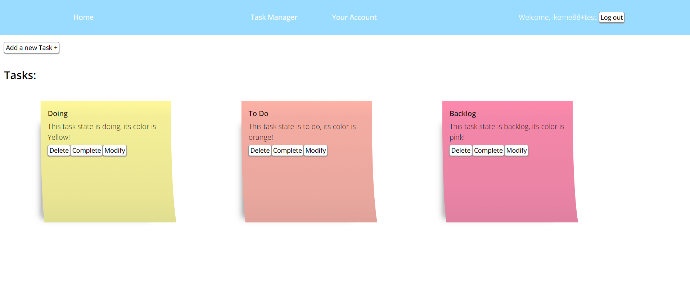

<!-- Structure -->
<!--I'm using markdown "reference" style links for readability.
*** Reference links are enclosed in square brackets [ ] instead of parentheses ( ).
*** See the bottom of this document for the declaration of reference variables
*** https://www.markdownguide.org/basic-syntax/#reference-style-links
-->
<!-- "back to top" -->

<!-- PROJECT LOGO -->
 

  
  <h3 align="center">Task App</h3>
  <a href="https://ironhack-final.vercel.app">Visit Website</a> 

<!-- TABLE OF CONTENTS -->

  
Table of Contents

  <ol>
    <li>
      <a href="#about-the-project">About the Project</a>
      <ul>
        <li><a href="#built-with">Built With </a></li>
      </ul>
    </li>
    <li>
    <a href="#roadmap">Roadmap</a>
     <ul>
     <li><a href="#backlog">Back log</a></li>
        <li><a href="#day-one">Tuesday 07, February 2023</a></li>
        <li><a href="#day-two">Wednesday  08, February 2023</a></li>
        <li><a href="#day-three">Thursday 09, February 2023</a></li>
        <li><a href="#day-four">Friday 10, February 2023</a></li>
        <li><a href="#day-five">Monday 13, February 2023</a></li>
        <li><a href="#day-six">Tuesday 14, February 2023</a></li>
        <li><a href="#day-seven">Wednesday 15, February 2023</a></li>
        <li><a href="#day-eight">Thursday 16, February 2023</a></li>
        <li><a href="#day-nine">Friday 17, February 2023</a></li>
        <li><a href="#day-ten">Monday 20, February 2023</a></li>
        <li><a href="#day-eleven">Tuesday 21, February 2023</a></li>
        <li><a href="#day-twelve">Wednesday 22, February 2023</a></li>
        <li><a href="#day-thirteen">Thursday 23, February 2023</a></li>
        <li><a href="#day-fourteen">Friday 24, February 2023</a></li>
        <li><a href="#future">Future</a></li>
      </ul>
    </li>
    <li><a href="#about">About</a></li>
    <li><a href="#acknowledgment">Acknowledgment</a></li>
    <li><a href="#technical-challenge">Technical Challenge</a></li>
    <li><a href="#big-mistake">Big Mistake</a></li>
    <li><a href="#cheat-sheet">Cheat Sheet</a></li>
  </ol>

<!-- ABOUT THE PROJECT -->

## About the Project

TaskIt was created as the final project of the Ironhack frontend bootcamp. The goal was to create a task web aplication using Vue 3 applying HTML, CSS and JS learnt in the bootcamp. I based the desing on post-it's because I use them in every day life to manage tasks. In addition to the guidelines I added an extra functionality to the app. Creating a dropdown menu which allows users to set a task state. Based on agile, users can select: "Backlog", "To do" or "Doing". The task state conditions the taskIt's color to pink, orange or yellow. 

Here are the guidelines for the final Vue.js project:

- [x] Creation of account: users will be able to register in the application through a Sign Up process, Log In and Log Out.
- [x] Task management: users will be able to create, edit, mark/unmark as completed and delete tasks.
- [x] Data storage: the application will be connected to Supabase and all the information of the tasks and users will be saved on that platform.
- [x] State management: Pinia stores will be used to connect with the backend and control the state of the application.
- [x] Navigation: Vue Router will be used to navigate the page without having to do a refresh.
- [x] Single Style: A single style file (assets/style.css) will be created and correctly inserted into main.js to access the classes and component ids.
- [x] Responsive design: the page will be responsive and will have at least two versions: mobile and desktop.
- [x] Deployment: the application will be deployed in Vercel.
- [x] Handling of asynchronous operations: asynchronous operations will be handled correctly with promises or async/await.
- [x] Documentation: a work path will be maintained in the repository's readme, updating it daily.

I have applied the Creative Commons License for this project. 

Project Links: [https://ironhack-final.vercel.app](https://ironhack-final.vercel.app)
              & [https://github.com/Ikerne/IronhackFinal](https://github.com/Ikerne/IronhackFinal)  

Presentation Link: [https://docs.google.com/presentation/d/1lg283dycfVgMR2mZiS0UTDD-YC9auNtIfAXftpCxAnY/edit?usp=sharing](https://docs.google.com/presentation/d/1lg283dycfVgMR2mZiS0UTDD-YC9auNtIfAXftpCxAnY/edit?usp=sharing) 

Resources:
    
<a href="https://dev.to/thormeier/fully-responsive-html-css-sticky-note-4okl">Sticky Note CSS</a>

    
<a href="https://colorhunt.co/collection">Color Palette</a>

    
<a href ="https://colordesigner.io/gradient-generator">Gradient Generator </a>
 <!---chose 20 to generate and chose first 4-->
    
<a href ="https://codepen.io/mutedblues/pen/MmPNPG">Hamburger Menu</a>

    
<a href="https://chat.openai.com">Chat GPT- general help</a>
 

(<a href="#readme-top">back to top</a>)

### Built With

This project was built with Vue 3, using HTML, JavaScript & CSS. Web page was launched using Vercel. GitHub was used for version safety and control. Supabase handles user authenthication and backend. 

(<a href="#readme-top">back to top</a>)

## Roadmap

Note: From monday 13 to friday 17 most of my time will be dedicated to an occupational hazard course. Less time will be spent working on the project during said week.

#### Backlog

#### Day One

###### Tuesday 07, February 2023
- [x] Create the repository
- [x] Import repository to GitHub
- [x] Read & review boilerplate
- [x] Plan next steps
- [x] Start README

#### Day Two

###### Wednesday  08, February 2023
- [x] Supabase profiles table 
- [x] Sign Up HTML & functionality
- [x] Sign In HTML & functionality
- [x] Sign Out HTML & functionality

#### Day Three

###### Thursday 09, February 2023
- [x] Create Task HTML & functionality
- [x] Read Task functionality
- [x] Delete Task deleteEmit 

#### Day Four

###### Friday 10, February 2023

- [x] Completed Task functionality
- [x] Update Task HTML & functionality

#### Day Five

###### Monday 13, February 2023
- [x] Profiles - handle, email, name on account page
- [x] Add priority/state to tasks

#### Day Six

###### Tuesday 14, February 2023
Focused on occupational hazard course

#### Day Seven

###### Wednesday 15, February 2023
Focused on occupational hazard course

#### Day Eight

###### Thursday 16, February 2023
- [x] Nav CSS
- [X] Profile CSS 
- [x] Sign In CSS
- [x] Sign Up CSS

#### Day Nine

###### Friday 17, February 2023
Focused on occupational hazard course

#### Day Ten

###### Monday 20, February 2023
- [x] Home CSS - create new task start
- [x] Home CSS - tasks conditional background color start

#### Day Eleven

###### Tuesday 21, February 2023
- [x] Home CSS - create new task
- [x] Home CSS - tasks conditional background color
- [X] Home CSS - task items as 3 columns 

#### Day Twelve

###### Wednesday 22, February 2023
- [x] Home CSS - modify task
- [x] Home CSS - solve css for tasks
- [x] Responsiveness 

#### Day Thirteen

###### Thursday 23, February 2023
- [x] Fix nav new issues due to responsiveness
- [x] Code cleanup
- [x] Finish README

#### Day Fourteen

###### Friday 24, February 2023
- [ ] Presentation
- [ ] Final details check

#### Future

###### Future ideas
- [ ] Profiles- avatar/profile image
- [ ] Task Manager view

(<a href="#readme-top">back to top</a>)

## About me

This bootcamp has been my first frontend experience, it's been intense, fun and interesting. I've worked as a Language Data Analyst for a company dedicated to AI solutions. 
 
Ikerne - [https://www.linkedin.com/in/ikernesg/](https://www.linkedin.com/in/ikernesg/) - ikernesanz@gmail.com

(<a href="#readme-top">back to top</a>)

<!-- ACKNOWLEDGMENTS -->

## Acknowledgment

I want to thank the three professors of this bootcamp at Ironhack; Diego Zito, Jarko Garrido and Aleix Abuli. Thank you for your time, information, patience and the extra hours to help solve all kinds of doubts. Also, to the SOC for providing me with this course so that I can continue training and growing professionally. To my classmates, thank you for the support and a great time! I would specially like to thank my classmate and friend Laura Anguita for the debugging, laughs and dancing!   

(<a href="#readme-top">back to top</a>)

## Technical Challenge

- Vue.js -> Understanding the components, where to reference what and how. Using the stores, connecting to supabase. As this was my first priject with vue.js and supabase understanding how everything works and how was a struggle. It took patience, time and support from classmates. 

- CSS flex confusion -> My Task container & wrapper CSS is a mess, I had to patch it up with margins and could not figure out where the issue is or how to fix it. It looks ok but I know it's not... eye twitch...

(<a href="#readme-top">back to top</a>)

## Big Mistake

- JS and Vue glitches -> The biggest mistake was not understanding fully what I was doing and getting desperate, stressed and frustrated. Little by little, with support from teachers and classmates, I was able to understand the code. Managing to add exta functionality to the app with "task status/color". 

- Underestimating CSS -> I thought the worst was over after I got all the functional parts to work and that the design would be easier. It seemed simple enough... before I stated working on it. It took more patience, effort and tirals than the rest. 

- Stress management -> When I got stuck, over glitches and flex, it frustrated me. Which got me obsessed, to the pont where forgot to eat or drink and laughed manically too many times to count. 

(<a href="#readme-top">back to top</a>)

## Cheat Sheet

- Check git satus:
git status

- Shortcut to add changes to GitHub:
git add . && git commit -m " " && git push

- Launch host app:
npm run dev

(<a href="#readme-top">back to top</a>)
